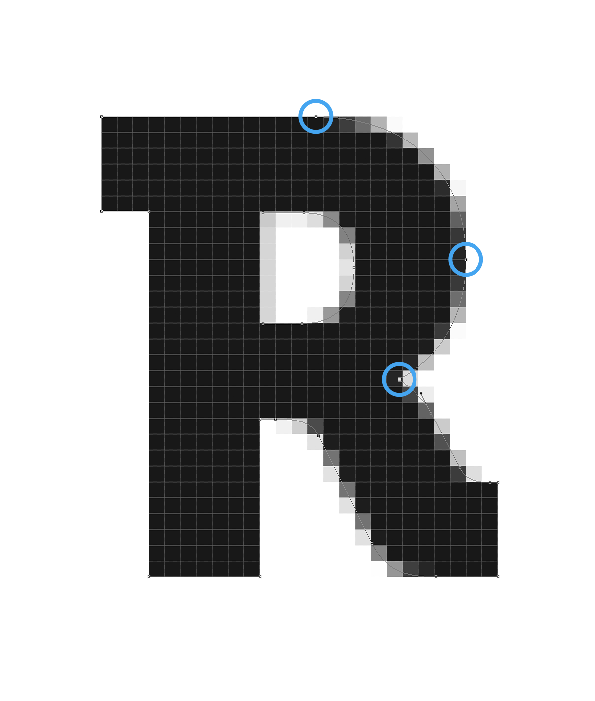

When looking at a website or interface, there are few things more annoying than half pixels. The resulting blurred edges make your potentially great product look hastily designed, uncared for and unfinished. Admittedly, if you are working with company logos, especially type-based ones, half pixels are a fairly regular occurrence and potentially frustrating to deal with. When it comes to icons, buttons or any other interface elements however&nbsp;there are no excuses.

So, today I thought I’d share some tips on Pixel Hinting – which very simply means moving your vector points so that they fall on the pixel grid.

### Dealing with type logos

If you are working with a non-vector logo, you’re going to have to redraw it to be able to get the best, pixel-perfect results. For this example however, we already have a vector ready to go in Photoshop.

[Download example.psd](http://downloads.realmacmedia.com/blog/155-photoshop-tutorial-pixel-hinting/example.zip)

As with any vector adjustment work, your best friends are going to be the Path and Direct Selection Tools as well as 3200% zoom. The actual process for doing this is very simple but depending on the size of the vector, it can get quite time consuming.

**Tip:** &nbsp;When using the Selection Tools, CMD+Click to quickly switch between the two.

#### Getting set up

Make sure that the “Snap Vector Tools and Transforms to Pixel Grid” option is deselected in your Photoshop preferences (Cmd+K). This will allow us to move our vector point in increments rather than 1px at a time.

#### Let’s get started

As this is a fairly repetitive process, we’re just going to fix the “R” here. It doesn’t have very good edges at the moment so should make for a good example. You will then be able to apply what you’ve learnt to the rest of the shapes.

Now let’s get started. This is the “R” zoomed up to 3200%. I like to begin at the top of a shape and work down.

As you can see, the top part isn’t too bad here. We’ll just nudge it up a little. Make sure you select all of the appropriate anchor points with the Direct Selection Tool.

Next we’ll fix the left side. Start by nudging in the top two anchor points then the second two out.

The bottom part isn’t too complicated either, just make sure you’re selecting the correct anchor points.

Finish up the outer part of the shape by bringing the last few points.

Now for the inner section. Nudge in the left anchor points then nudge out the right ones.

And we’re done! As you can see, it’s a very simple process that produces good results. Not all shapes are as straight forward as this one though. There are times when you might have to compromise and use a half pixel to keep the recognisable features of the shape intact but as a general rule, pixel hint!

### Dealing with icons

Using icon sets is fine for quick mockups, but for final releases you should always make custom icons. I don’t pixel hint in quick mockups because they serve only to get your ideas out there and your time can be much better spent elsewhere. However, when the time comes to do your final icons here are a couple of tips:

**Setup:** I like to do icons in a separate PSD. Start by setting your background to #ffffff if it isn’t already and your vector colour to #000000. Black on white is the easiest way to spot those half pixels.

**Know your dimensions:** If your icons are going to be displayed at 32×32, there’s no point in making them at 46×46 or any other dimensions. Setup some guides in your new PSD and design for the size they’re going to be displayed at.

I hope you found this article helpful, and be sure to let me know on Twitter if there are any other Photoshop topics you’d like me to cover in future posts.

_This post was originally written for the Realmac Software [blog](http://realmacsoftware.com/blog/a-guide-to-pixel-hinting)._
  