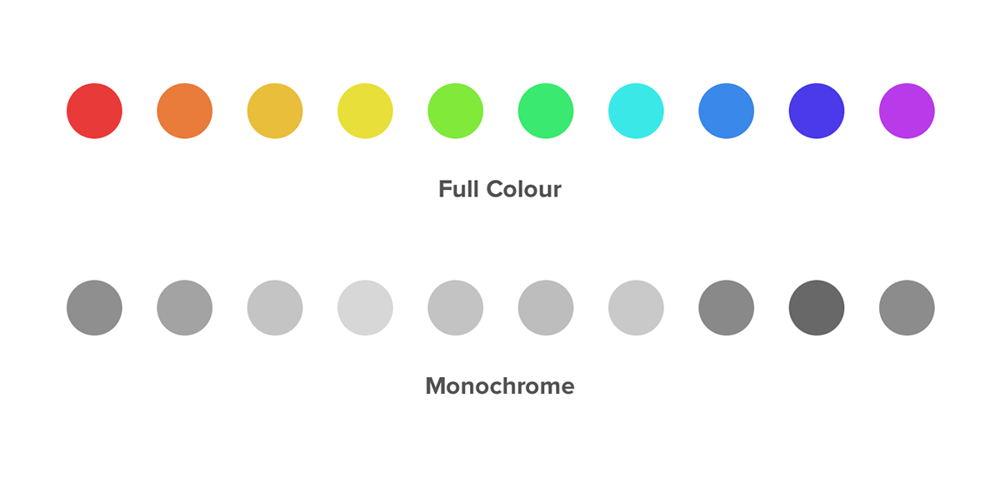
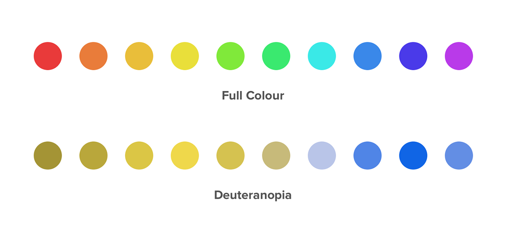
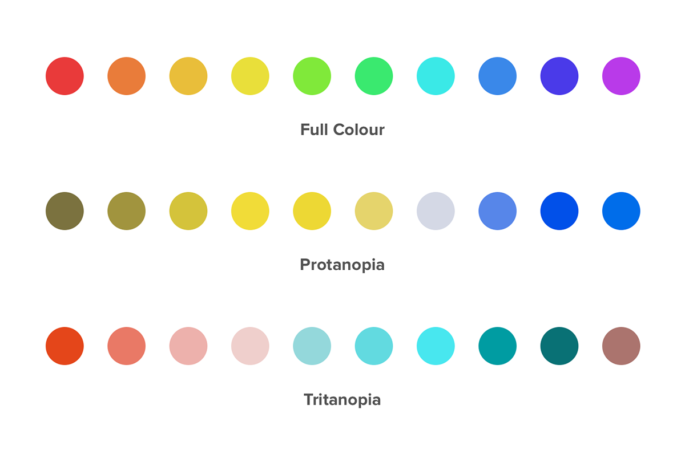
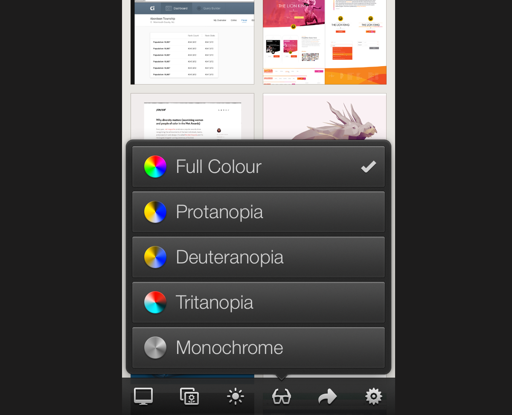

Launching into the design (or redesign) of your app is exciting. You’ve got plenty of ideas floating around, sketches and wireframes everywhere and when the time comes to get cracking in Photoshop, you can’t wait to get started. At this stage there are plenty of thing to keep in consideration — colours, typography, grids etc. — but with these comes another consideration that is equally as important: accessibility.

As an app designer or developer, it’s normal to want to get as many people using your creation as possible. Unfortunately, there are many people who suffer from various forms of disability that could potentially hinder the experience they have with your app if these disabilities have not been taken into consideration in the design process. Each person that has a bad experience with your app means (at least) one less user for you and obviously, that’s something we don’t want.

The main types of disability that can have an effect on how people experience your app are as follows:

- **Visual** : This includes people who are completely, partially, or colour blind amongst others.
- **Auditory** : People who are completely or partially deaf are included in this category as are those who have bad speech perception.
- **Cognitive** : This includes people who have learning disorders, dyslexia amongst others.
- **Motor** : The results of motor impairment include lack of muscle control, poor stamina and muscle weakness amongst others. Each of the the above merit their own blog post so today we’re going to focus specifically on the various types of colour blindness, understanding them and testing for them to ensure the best possible experience for visually impaired people.

### What is colour blindness?

If somebody is colour blind that does not necessarily mean that they are monochromats — people who can only distinguish brightness variations but not colours — which is the rarest form of colour blindness. It more commonly refers to people who have difficulty perceiving reds, yellows and greens from one another.

Deuteranopia, a subtype of red/green colour blindness, is the most common form of colour blindness affecting an estimated 1% of all males. This does not mean that people affected with this type of colour blindness will mix up red and green, but rather that they will confuse colours that are made up of red or green as a whole. For example, not being able to distinguish the difference between blue and purple.

### The different types of colour blindness

We have already talked about the most common (deuteranopia) and the least common (monochromacy) types of colour blindness but there are two more variations that we should to be aware of as well:

- **Protanopia:** The inability to distinguish between blue and green colours as well as between red and green colours.
- **Tritanopia:** These people will confuse green with blue and yellow with violet.

### What can we do as designers?

With the release of iOS 7, Apple has put a lot of focus on colour. Each app should have one key colour that defines all of the interactivity throughout the app (for example orange in Ember).

When selecting your colour palette, this is important to keep in mind. If your body, headline and key colours are indistinguishable from one another for someone with one of the aforementioned disabilities then all notion of colour based interactivity is lost within your app. Not good.

iOS 7 does offer some extra accessibility settings for people with disabilities, however these should not be relied on. They’re there to work with your app, helping out where possible (increasing text size with dynamic type etc.). They are not there to do all of the accessibility work for us.

### Testing for visual disabilities

Fortunately, there are ways we can test our designs to make sure that everyone can have the same experience with our app.

Photoshop offers built-in testing for the two most common types of colour blindness, deuteranopia and protanopia.

[Skala Preview](https://itunes.apple.com/app/skala-preview/id498875079?mt=12&at=1l3vn5T) is my tool of choice for seeing what my designs look like, in real time, on a device. It is particularly useful because it also has the ability to to preview designs from the point of view of people with deuteranopia, protanopia and tritanopia as well as monochromats.

[Sim Daltonism](https://itunes.apple.com/ca/app/sim-daltonism/id693112260?mt=12&l=en&at=1l3vn5T) will allow you to test all of the visual impairments we have discussed directly on your Mac.

### Wrapping Up

With the ever growing ownership of smartphones, computers and various other digital interfaces it is more important than ever to ensure that what we create is accessible to the largest amount of people possible. This means taking into consideration not only ourselves but those who have visual, auditory, cognitive or motor disabilities as well.

_This post was originally written for the Realmac Software [blog](http://realmacsoftware.com/blog/a-guide-to-pixel-hinting)._
  