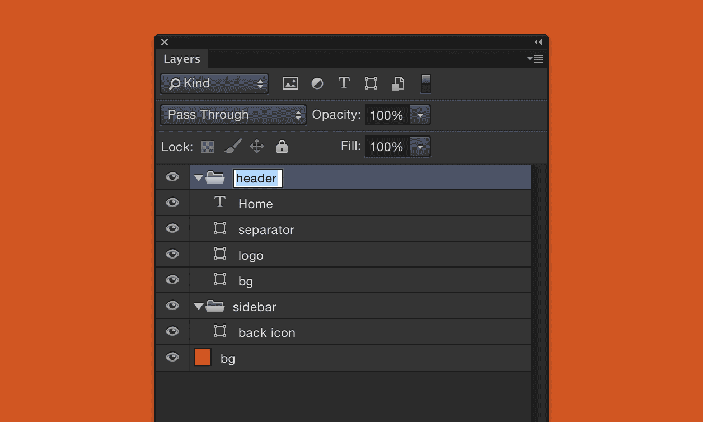
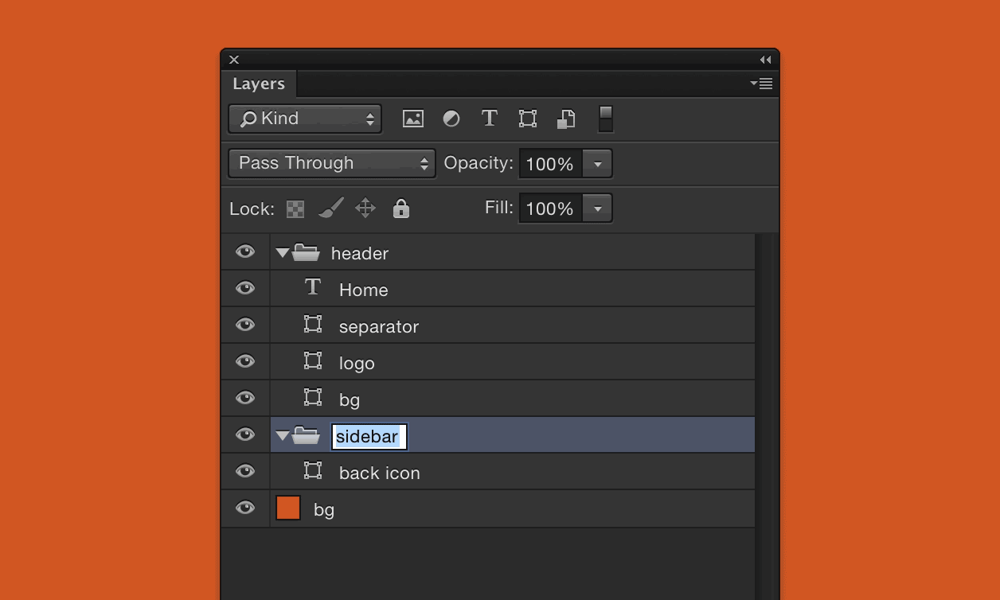

The fastest way to manually rename a bunch of layers in Photoshop is to double-click / run your keyboard shortcut for “Layer” → “Rename Layer…” (in my case `Shift+CMD+R`) on one then use the tab key to apply the new layer name and jump to the next visible layer. I’ve known about this shortcut for a good long while now.

What I only learnt a couple of weeks ago by happy accident however, is that by holding down the shift key whilst pressing tab you can reverse the order of the renaming so that rather than cycling through layers from top to bottom, you can go bottom to top.

I thought this might have been a discreet addition in CC 2015 but no. As I found out after a quick search, it’s been in Photoshop for a good few years now (since CS6).
  