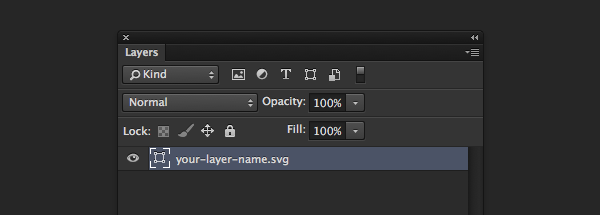

Since the release of version 14.2 in January, Photoshop CC has had the ability to export SVGs with Adobe Generator. Whilst the developers still consider this to be an experimental feature, I have been using it for a while without any major issues.

To enable SVG exporting, we will need to create a configuration file for Generator.

### Create the configuration file

- Quit Photoshop.
- Open your favourite text editor and paste in the following:

```
{
  "generator-assets": {
    "svg-enabled": true
  }
}
```

- Save the file in your home folder—in my case /Users/Elliot—and name it generator.json.
- Restart Photoshop.

If you don’t like the sound of that then you can just [download the file here](http://c.elliotekj.com/UlaA/download/generator.json.zip), put it in your home folder, restart Photoshop, and you’re good to go.

### Export as an SVG

Open up your PSD and go to File \> Generate \> Image Assets. You will need to do this for each PSD you want to use Generator with.

When naming the layer (or group) you want to export, append .svg to the layer name. For example, your-layer-name.svg.



It takes a couple of minutes to setup the first time but once done, your SVGs will export alongside your PNGs and any other generated assets.

As I said, this is still an experimental feature so it isn’t perfect yet. However, I have found that it has coped well with 90% of what I’ve used it for.

The beauty of it is that if it isn’t working for you as well as you’d like, you can do something about it. All of the the code is [open source on Github](https://github.com/adobe-photoshop).
  