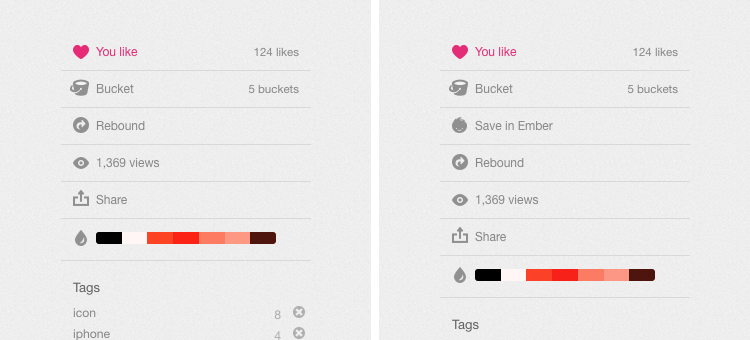

I’ve written this as an accompaniment to the _Save in Ember_ Chrome extension I’ve just [put up on Github](https://github.com/ElliotEKJ/save-in-ember).

I’ll walk through the basics of Chrome extensions then show you the bits and bobs that make up this one.

It’s functionality is fairly straight forward: when you’re on `https://dribbble.com`, it’ll add a button in the likes panel that — when clicked — will send the shot straight to your [Ember](http://realmacsoftware.com/ember) library. This is made possible by one of Ember’s URL schemes: `emberapp:///import?url={{URL}}`.



You’ll still find parts of this post informative, even if you don’t have a copy of Ember. Should you want to try it out however, there’s a 14 day [free trial](http://realmacsoftware.com/ember#download) of Ember available on our site.

Before we crack on, it’s worth noting that Ember already has a far more fully featured extension available for both Safari and Chrome. This was just a bit of fun.

### The Basics

In Chrome, browser extensions boil down to a collection of HTML, CSS and Javascript files (images are also allowed). In essence, they’re web pages that have access to a bunch of [APIs](https://developer.chrome.com/extensions/api_index) allowing them to interact with the browser’s content. How simple or complex your extensions are is really down to your own imagination.

The Chrome team have done an excellent job documenting everything you could possibly want to know when building your extension. Said docs are available on their Developer site, [here](https://developer.chrome.com/extensions).

### The Structure

As it only contains a few files, I kept the folder structure of _Save in Ember_ fairly flat. You can organise things into seperate folders if you wish, just remember to update the paths in `manifest.json` when you do (more on that later).

```
send-to-ember/
    inject.css
    inject.js
    jquery.min.js
    manifest.json
    img/
        icon_ember.png
        icon_ember@2x.png
        icon_ember_hover.png
        icon_ember_hover@2x.png
```

- `manifest.json` is included in every Chrome extension out there. It’s there to give Chrome information about the extension (version, author, et cetera) as well as to tell it what it requires by way of permissions.
- `inject.css` and `inject.js` contain the styles and scripts we’re going to insert into the webpage once it’s loaded.
- `jquery.min.js` is simply a copy of jQuery.
- `img/` just contains the Ember icon we’re going to use on the button.

### The Breakdown

Now for the good stuff. Let’s go through each of these files and see what’s going on.

#### manifest.json

```json
{
  "name": "Save in Ember",
  "version": "1.0",
  "manifest_version": 2,
  "description": "A simple Chrome extension that adds a `Save in Ember` button next to Dribbble shots.",
  "homepage_url": "http://casualnotebook.com/lets-make-a-simple-browser-extension-for-chrome",
  "content_scripts": [{
    "css": [
      "inject.css"
    ],
    "js": [
      "inject.js",
      "jquery.min.js"
    ],
    "matches": [
      "https://dribbble.com/*"
    ]
  }],
  "web_accessible_resources": [
    "img/*.png"
  ]
}
```

- `name`, `version`, `description` and `homepage_url` are all fairly self explanatory.
- `manifest_version` tells Chrome the version of the [manifest file](https://developer.chrome.com/extensions/manifest) format your extensions requires. Version 1 has been considered deprecated since Chrome 18.
- `content_scripts` are files run within the webpage. Be forewarned: they do not have access to a majority of Chrome’s APIs.
- `web_accessible_resources` tells Chrome the paths of files we want to have access to within the webpage. They can either be direct or use a wildcard.

_Note: `name`, `version`, and `manifest_version` are the only required parameters in a `manifest.json` file._

#### inject.css

```css
.meta-ember {
  background-image: url('chrome-extension:// __MSG_@@extension_id__ /img/icon_ember.png');
  background-position: 12px 9px !important;
  cursor: pointer;
}

.meta-ember:hover {
  background-image: url('chrome-extension:// __MSG_@@extension_id__ /img/icon_ember_hover.png');
  color: #444 !important;
}

@media
(-webkit-min-device-pixel-ratio: 2),
(min-resolution: 192dpi) {
  .meta-ember {
    background-image: url('chrome-extension:// __MSG_@@extension_id__ /img/icon_ember@2x.png');
    background-size: 15px 16px;
    background-position: 12px 9px !important;
  }

  .meta-ember:hover {
    background-image: url('chrome-extension:// __MSG_@@extension_id__ /img/icon_ember_hover@2x.png');
    background-size: 15px 16px;
  }
}
```

We’re going to re-use some of the CSS Dribbble already loads in it’s own stylesheet so there isn’t much to see here. We’re just telling our button which icon it should load on normal and high resolution screens. Make sure that any assets you want to use in injected CSS are declared under `web_accessible_resources` in your manifest file.

Where this differs from the CSS you’re used to is in the `background-image` path. Links to packaged resources within injected files need to have `chrome-extension:// __MSG_@@extension_id__ ` prepended to them. If you simply used `background-image: url('/img/icon_ember.png');` then your injected CSS would look for an `icon_ember.png` file in an `img` directory on the website’s own server, not within your extension.

#### inject.js

```js
chrome.extension.sendMessage({}, function(response)
{
  var readyStateCheckInterval = setInterval(function()
  {
    if (document.readyState === "complete")
    {
      clearInterval(readyStateCheckInterval);
      // Page is done loading
      ///////////////////////////////////////

      // Get the image link
      var image_link = $(".single-img img").attr("src");

      // Insert the button
      $(".meta-act:nth-child(2)").after("<div class='meta-act meta-act-full'><span class='meta-act-link meta-ember' id='send-to-ember'>Save in Ember</span></div>");

      // Open the tab in the background
      document.getElementById("send-to-ember").addEventListener("click", generateLink, false);

      function generateLink()
      {
        var a = document.createElement("a");
        a.href = "emberapp:///import?url=" + image_link;

        var evt = document.createEvent("MouseEvents");
        evt.initMouseEvent("click", true, true, window, 0, 0, 0, 0, 0, true, false, false, false, 0, null);
        a.dispatchEvent(evt);
      }

    }
  }, 10);
});
```

- Lines 1 through 7 make sure our code only runs once the page has loaded.
- Line 12 get’s us the URL of the image we’re going to be sending to Ember by looking within the `.single-img` div each shot is wrapped in.
- Line 15 inserts our button in the likes panel. We’re re-using Dribble’s own classes here to save us from having to do style updates.
- Instead of directly linking to the image with something like `<a href="emberapp:///import?url={{URL}}">Save in Ember</a>` which would open a new tab, we should open it in the background so that the Dribbble-browsing experience isn’t interrupted. The button we inserted on line 15 is actually just a trigger with fake link properties we setup in the CSS file (:hover). Once it’s clicked, lines 18 through 28 generate a link with the URL scheme and image URL then fake an Option+Click on it to open it in the background

### What’s next?

If you want to tinker with this, you can [download it over on Github](https://github.com/ElliotEKJ/save-in-ember). Put it in a folder, open the extensions tab in Chrome’s preferences, make sure “Developer mode” is checked, then drag the folder onto the window.

If you just want to use it then you’ll also find a link to the latest version, bundled up and ready to go, in the repo’s description.
  