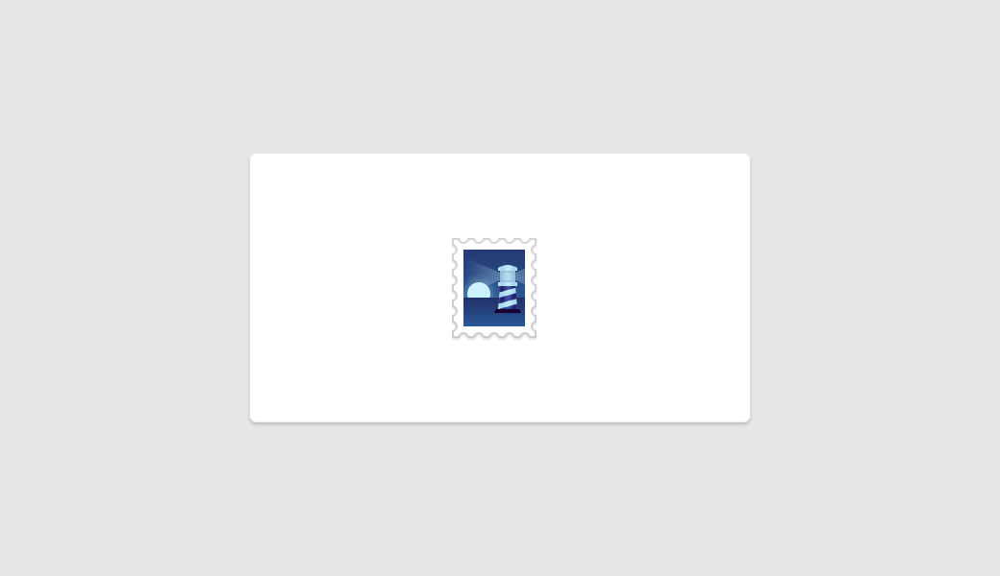

I spent this afternoon in Photoshop working on some branding ideas for Readership, the app I’m working on, as well as some dashboard mock-ups.

From the beginning I’ve imagined that Readership’s logo would include a boat of some description as it fits in well with the premise of the app. During my exploration however, a lighthouse came into the mix and stuck.

Readership won’t actually do any shipping on first release, though that is the longer term plan. It will however make a process that is notoriously difficult a lot easier: a lighthouse fits well.

When you think lighthouse, what do you think? Personally: red and white stripes, a big bulb and, for whatever reason, Scotland. My issue is with the red and white stripes. This logo is going to be used in a lot of places that a) I want red no where near to due to it’s association with errors and danger, b) I want it to be easily recognisable but not to overly draw the eye, and c) can effectively have any background colour.

Along with the lighthouse came the idea of a stamp which provides a few advantages: it fits the product, the pure white border around the smaller inner illustration means that it will work well on dark backgrounds and due to the thickness of the border, a light gray stroke can be applied to it when used on lighter backgrounds without it losing it’s detail or becoming blurry.

I ended up with the piece below. I’m still not 100% happy with the window section of the lighthouse and the contrast of the logo in general needs more work but overall I feel like I have a fairly solid base to work from. I particularly like the monochrome as it kills three birds with one stone: it looks good, it solves my red stripe issue and it doesn’t draw the eye too much.

  