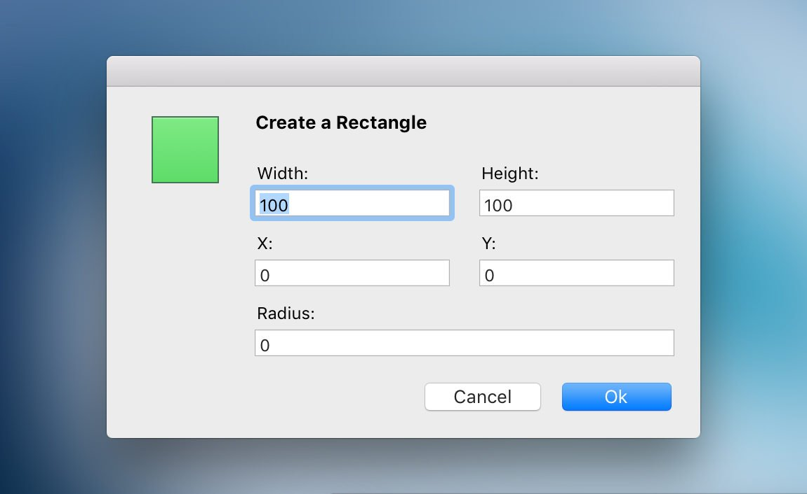

Yummygum were [on Twitter](https://twitter.com/yummygum/status/740846589468680192) yesterday searching for a Sketch plugin to generate a shape based off of specific user-inputted dimensions. As it happened, there wasn’t one. So I built one.

Specify has a couple of nice features that the Photoshop one doesn’t:

- If you have a layer selected, it will automatically set the initial `x` and `y` values to those of the selected layer.
- It supports Sketch’s differently-sized-border-radii syntax of, for example, `4/4/0/0` for top left `4`, top right `4`, bottom right `, bottom left`.

The source for it is up on GitHub, along with the installation instructions and more information on customisation. The JS is fairly well commented too if you want to go and have a look at how it works.

[**Download on GitHub**](https://github.com/ElliotEKJ/specify)
  