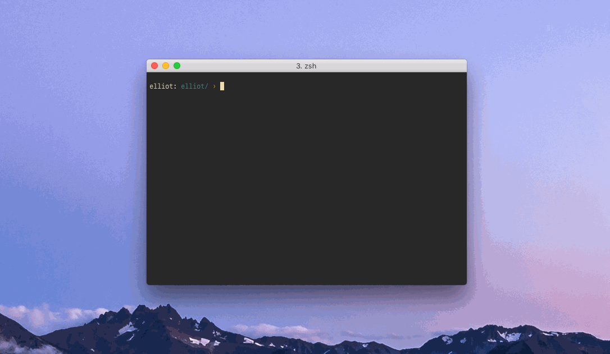
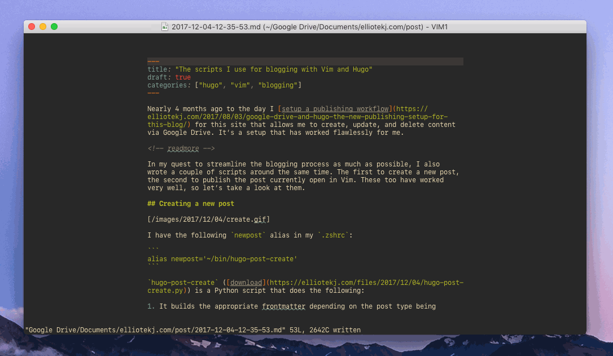

Nearly 4 months ago to the day I [setup a publishing workflow](https://elliotekj.com/2017/08/03/google-drive-and-hugo-the-new-publishing-setup-for-this-blog/) for this site that allows me to create, update, and delete content via Google Drive. It’s a setup that has worked flawlessly for me.

In my quest to streamline the blogging process as much as possible, I also wrote a couple of scripts around the same time. The first to create a new post, the second to publish the post currently open in Vim. These too have worked very well, so let’s take a look at them.

### Creating a new post

[](./create.gif)

I have the following `newpost` alias in my `.zshrc`:

```
alias newpost='~/bin/hugo-post-create'
```

`hugo-post-create` ([download](https://elliotekj.com/files/2017/12/04/hugo-post-create)) is a Python script that does the following:

1. It builds the appropriate frontmatter depending on the post type being created — a regular post like this one, a link post, or a micropost — and marks it as a draft.
2. It creates a new file containing the generated frontmatter in the Google Drive folder that houses all of the content on this site.
3. Lastly, it opens the new file Vim.

All that’s left for me to do is actually write the post and publish it, which brings us nicely to…

### Publishing a post

[](./publish.gif)

Once written, a post needs 2 changes made to its frontmatter in order for [Hugo](https://gohugo.io) to include it when it regenerates the site:

1. The `draft: true` line needs to either be removed or set to `false`.
2. A `date` key-value needs to be added, formatted as an “RFC 3339”.

Both of these changes are made by a second script that’s run directly in Vim with this mapping:

```vim
" Publish post:
nnoremap <leader>xp :w<bar>silent! %!~/bin/hugo-post-publish<cr>:w<cr>
```

The mapping breaks down as follows:

1. Save the file.
2. Run the `hugo-post-publish` ([download](https://elliotekj.com/files/2017/12/04/hugo-post-publish)) script and replace the contents of the file with the string returned by the script.
3. Save the file again.

With the frontmatter updated, all that’s left to do is to wait for Google Drive to sync the change. My server-setup will take care of the rest by pulling down the latest changes made to the shared Google Drive folder then running Hugo to regenerate the site.

Having experimented with a lot of the options out there over the years, I can say that this is without a doubt the lowest-hassle setup I’ve ever had.

