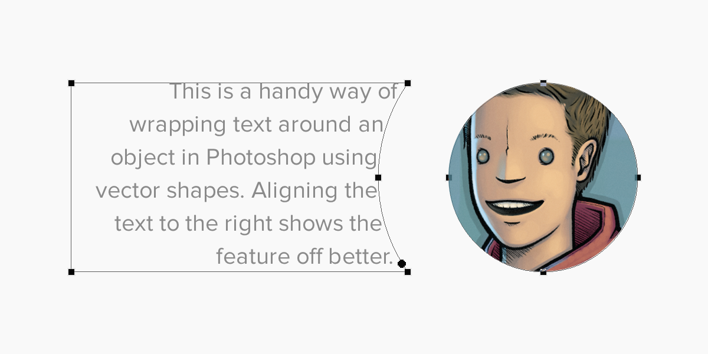
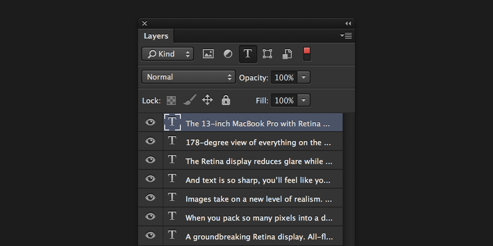

In this post I’m going to show you some of the tools that I use in my workflow when working with type in Photoshop.

### Anti-Aliasing

The elephant in the room seems to be as good of a place as any to start this post. In previous versions of Photoshop (pre-CS6) selecting the type of anti-aliasing method to use came down to choosing the best from a bad bunch really. However, a few months ago Adobe introduced two new OS-native options in the anti-aliasing settings in Photoshop: “Mac” and “Mac LCD”. These options aim to replicate the system anti-aliasing for fonts: “Mac” replicating OS X’s greyscale font smoothing and “Mac LCD” its sub-pixel font smoothing.For web designers, the CSS equivalent to “Mac” would be:

```css
-webkit-font-smoothing: antialiased
```

and the equivalent of “Mac LCD”:

```css
-webkit-font-smoothing: subpixel-antialiased
```

As iOS uses greyscale anti-aliasing for all of its type rendering, you should use the “Mac” anti-aliasing method in Photoshop when designing for iOS devices.

### Character and Paragraph styles

Character and Paragraph style panels shipped with CS6 and allow you to save the attributes you’ve set for a specific text layer to then re-apply the exact same styling to other layers. To display the panels, go to Window \> Character/Paragraph Styles in the main Photoshop window.

I find this feature very useful for keeping all of my typography consistent throughout a project.

If you are unfamiliar with this feature, Tuts+ have a handy [getting started video](http://psd.tutsplus.com/tutorials/tutorials-effects/paragraph-and-character-styles-photoshop-cs6/) on their site.

### Wrap text with paths

I only really use this when doing web design but it’s still good to know about. If you want to wrap text around an image then you can do so fairly easily with vector paths. Make sure to have a look at this [video tutorial from “Method and Craft”](http://methodandcraft.com/videos/shaping-textfields-in-photoshop) if you’re unsure how to achieve this.



### Filter Text Layers

This is a fairly well known feature in Photoshop but I still find it useful. At the top of the layers panel there are various filtering methods including “Filter for Type Layers”. Activate this to only show text layers in the panel. It can be handy for making bulk changes to a project.



### Paste Lorem Ipsum

Another useful little time saver that shipped with CS6 is the ability to paste Lorem Ipsum text into your document from within Photoshop. When editing a text layer, go to Type \> Paste Lorem Ipsum in the main menu to paste a paragraph of dummy text. I would recommend assigning a keyboard shortcut to this to make it even quicker.

### Font Management

I use OS X’s built-in Font Book to manage the 269 fonts I currently have installed on my system. I have tried a lot different 3rd party font management applications in the past but they always ended up breaking something and felt unnecessary for the few fonts that I actually use.

There we have it. These are some of the things I do when working with type in Photoshop to improve my workflow. Hopefully you found this post useful! Let me know if there are any other aspects of Photoshop you would like me to talk about in further blog posts, on Twitter.

_This post was originally written for the Realmac Software [blog](http://realmacsoftware.com/blog/a-guide-to-pixel-hinting)._
  